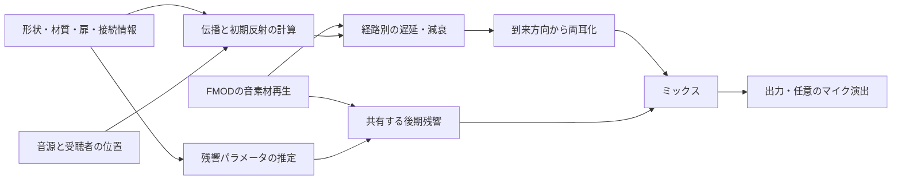

# Bodycamの空間音響と独自実装に向けた調査

調査日: 2026-09-21（JST）  
対象リポジトリ: `D:/Pandd/ShinShinzui`、調査時HEAD: `a20fc1e`  
位置づけ: 調査・技術候補の比較資料。実装済みの報告や承認済みの最終仕様ではない。今回はコード、Unity設定、FMODプロジェクトを変更していない。

## 1. 調査結果

**Bodycamは、環境に応じた残響・開口を通る伝播・遮蔽・定位改善に、録音素材とミックスの作り直しを組み合わせている。独自技術の開発は公式に説明されているが、公開情報から内部アルゴリズムやSDK構成までは特定できない。**

したがって、次の実装ではBodycamの非公開コードを再現するのではなく、確認できる聞こえ方を目標とし、公開研究を根拠として方式を選ぶ。以下の論文をBodycamが採用したという証拠は見つかっていない。

### 公式情報から確認できたこと

| 内容 | 確認できた範囲 | 根拠 |
| --- | --- | --- |
| 使用エンジン | Unreal Engine 5 | [Bodycam公式サイト](https://www.playbodycam.com/en-US) |
| 独自の音響技術 | 開発元は独自技術の研究開発を説明。材質、開口、室内位置を音作りに反映する方針 | [2026-03-06 Roadmapの公式本文](https://steamcommunity.com/app/2406770/announcements/?l=italian) |
| Organic Reverb | 周囲の環境をリアルタイムに解析し、残響を生成する仕組み | [2026-08-21 Devlog #2公式告知](https://steamcommunity.com/games/2406770/announcements/detail/675126551624287627) |
| 音の伝播 | 部屋、廊下、階段、窓、開放空間を経由する音を扱う | [同Devlog #2](https://steamcommunity.com/games/2406770/announcements/detail/675126551624287627) |
| Shockwave propagation | 廊下・階段・開口を通る伝播と、銃声・衝撃波への距離／音量の遮蔽処理を更新に掲載 | [2026-09-02 Major Update公式本文](https://store.steampowered.com/news/posts/?enddate=1788368994&feed=steam_community_announcements) |
| 上下方向の聞き分け | 階の違いと足音の位置・高さの表現を改善したと説明 | [同Major Update](https://store.steampowered.com/news/posts/?enddate=1788368994&feed=steam_community_announcements) |
| 音素材とミックス | 武器の新録、操作音、弾丸の通過音なども再制作 | [Devlog #2](https://steamcommunity.com/games/2406770/announcements/detail/675126551624287627) |
| 聴取の表現 | 実際のボディカメラ録音を研究し、耳で直接聞く音とは異なるマイクの音を意識 | [Roadmap公式本文](https://steamcommunity.com/app/2406770/announcements/?l=italian) |

これは開発元の説明を確認したものであり、製品内部の計算を測定・解析した結果ではない。

### 確認できなかったこと

- Steam Audio、FMOD、Wwise、MetaSounds等の実際の採否と担当範囲。
- レイトレーシング、波動方程式の数値解、鏡像法、FDN、畳み込みのどれを使用しているか。
- HRTFの採用、データセット、個人化、Ambisonicsの次数。
- 全室のインパルス応答を事前収録しているか、ベイクと実時間計算をどう分けているか。
- 帯域数、反射次数、更新頻度、CPU/GPUの分担、最大同時音源数。

**「独自技術あり」から「音声経路の全段を自作」「Steam Audio不使用」とは結論できない。** また、公式の“shockwave”という名称や伝播の可視化だけでは、波動方程式を実時間で解いている証拠にならない。Bodycamの上下定位改善をHRTF採用の証拠として扱うこともできない。

### 公式Devlogで説明されている具体的な動作

公式動画の英語自動字幕を取得して内容を確認した。以下は字幕の要約であり、音の実聴評価や映像からの内部構造解析ではない。

| 開始時刻 | 開発元の説明 |
| --- | --- |
| [1:29](https://www.youtube.com/watch?v=Oz66Ek1RYWU&t=89s) | 発砲周囲の部屋寸法、天井高、窓・廊下の開口、閉鎖度、空気の逃げやすさを動的に分析 |
| [2:43](https://www.youtube.com/watch?v=Oz66Ek1RYWU&t=163s) | 廊下内を伝わる音と、開口から屋外へ抜ける音を説明 |
| [4:18](https://www.youtube.com/watch?v=Oz66Ek1RYWU&t=258s) | 屋外から屋内へ移動しながら発砲すると、音が滑らかに変化 |
| [4:50](https://www.youtube.com/watch?v=Oz66Ek1RYWU&t=290s) | 壁越し遮蔽、上下定位、手榴弾の環境応答を紹介 |
| [7:27](https://www.youtube.com/watch?v=Oz66Ek1RYWU&t=447s) | 38種の足音表面と、同じ材質の状態差・方向転換時の音を制作 |
| [9:19](https://www.youtube.com/watch?v=Oz66Ek1RYWU&t=559s) | カメラ越しのミックス、身体振動、回転に応じた風、屋内の風減衰、カメラ調整時のこもりを表現 |

### 情報の取得範囲

Devlog #2のSteam個別記事は本文と2026-08-21の日時を確認した。[公式動画](https://www.youtube.com/watch?v=Oz66Ek1RYWU)は英語自動字幕を確認しており、手動の逐語校正は行っていない。動画タイトルは変更され得るため、参照はSteam記事名と動画IDを基準とする。字幕にも具体的な音響アルゴリズム名・SDK名は確認できなかった。字幕全文は引き継ぎ資料へ複製せず、必要な箇所を要約して時刻リンクを付けた。

RoadmapはSteam公式の検索インデックスに掲載された本文で確認した。Steam一覧は表示内容が更新され、通常のページ取得では古い投稿が出ない場合がある。記事名は「BODYCAM 2026 ROADMAP PART 1」、日付は2026-03-06、該当節は「SOUND DESIGN」。非公式Wiki、まとめ動画、掲示板の推測を技術採用の根拠にはしていない。

## 2. 自作で分けて考える機能

ここからは調査に基づく本プロジェクト向けの提案であり、Bodycam内部の構成図ではない。

| 機能 | 計算・処理するもの | 単独では解決しないもの |
| --- | --- | --- |
| 伝播 | 直達、壁の遮蔽・透過、開口経由の経路長・到来方向 | 左右耳の信号生成 |
| 初期反射 | 壁から戻る少数の反射の時刻、方向、帯域別減衰 | 密な残響の尾 |
| 後期残響 | 空間の減衰時間、拡散、帯域別の尾 | 壁裏音源の正しい到来方向 |
| 両耳レンダリング | HRTF/HRIRによる方向依存の左右信号 | 壁・開口の経路探索 |
| 音作り | 音素材、マイク特性、圧縮、近接感、演出 | 幾何形状に追従する伝播 |

立体音響とリバーブは別機能である。左右の音量差だけを作っても、耳介等による方向依存のスペクトルは再現できず、前後・上下の聞き分けは完成しない。一方、HRTFを導入しても壁や開口の経路は計算されない。[Wenzel et al., 1993](https://doi.org/10.1121/1.407089)、[SOFA公式説明](https://sofaconventions.org/mediawiki/index.php/General_information_on_SOFA)

Bodycamのマイク表現を参考にする場合も、ゲームで必要な定位を保ったまま別の処理として調整する。マイクらしい音色と人間の両耳の再現を同一視しない。強い歪みや圧縮が必須という根拠も、今回の公式資料からは得られていない。

## 3. 実装に使える論文

優先度と難易度は今回の用途に対する評価。各論文の比較条件を本プロジェクトの性能保証として流用しない。

### P1 — 初期反射の基礎：Image Method

**J. B. Allen, D. A. Berkley (1979), “Image method for efficiently simulating small-room acoustics,” JASA 65(4), 943–950.** [DOI](https://doi.org/10.1121/1.382599)／[著者公開PDF](https://jontalle.web.engr.illinois.edu/Public/AllenBerkley97.pdf)

- 壁に対して音源を鏡映し、反射経路の長さ・到着時刻・振幅を計算する基礎。矩形の小部屋や直線トンネルの一次反射を実装し、解析解と照合する用途に向く。
- 原論文は矩形室。任意メッシュへの応用には、反射点が面の内側にあるか、各区間が遮られていないかの確認が必要。低周波の回折は扱わない。
- **優先度: 最初の試作。難易度: 低〜中。** 全次数の反射を列挙せず、最初は一次反射を基準にする。

### P2 — 残響の尾：周波数別RT60を制御するFDN

**S. J. Schlecht, E. A. P. Habets (2017), “Accurate Reverberation Time Control in Feedback Delay Networks,” DAFx-17, 337–344.** [学会PDF](https://dafx.de/paper-archive/2017/papers/DAFx17_paper_11.pdf)／[著者ページ](https://www.sebastianjiroschlecht.com/publication/schlecht-2017-va/)

- 複数の遅延線をフィードバック行列で結ぶFDNについて、周波数別の残響時間を減衰フィルターで制御する。高音が早く消え、低音が残る尾を作れる。
- フィルターの近似誤差がRT60の大きな誤差になり得ることと、その改善方法が実装に有用。形状から目標値を推定する処理は別途必要。
- **優先度: 最初の試作。難易度: 中。** 8〜16本程度の遅延線を初期比較候補とするが、この本数は本調査の提案であって論文やBodycamの指定ではない。

### P3 — 形状と残響を直接結ぶ代案：Scattering Delay Network

**E. De Sena, H. Hacıhabiboğlu, Z. Cvetković, J. O. Smith III (2015), “Efficient Synthesis of Room Acoustics via Scattering Delay Networks,” IEEE/ACM TASLP 23(9), 1478–1492.** [DOI](https://doi.org/10.1109/TASLP.2015.2438547)／[著者preprint](https://arxiv.org/abs/1502.05751)

- 壁の一次反射点に散乱ノードを置き、距離と材質から遅延・減衰を作る。一次反射を保ち、高次反射を近似する。部屋の寸法や吸音率が変わると響きも変わる方式として有力。
- 原論文の矩形室の評価から、任意の曲がった通路や開放空間での精度を保証することはできない。移動時の遅延変化による音切れやピッチ変化への対処も必要。
- **優先度: FDN案との比較候補。難易度: 中〜高。** P1＋P2を基準にし、SDNへ置換して比較する。FDNとSDNを理由なく直列に重ねない。

### P4 — 隣室・曲がり角：Reverberation Graphs

**E. Stavrakis, N. Tsingos, P. Calamia (2008), “Topological Sound Propagation with Reverberation Graphs,” Acta Acustica united with Acustica 94(6), 921–932.** [DOI](https://doi.org/10.3813/AAA.918109)／[研究室ページ](https://www-sop.inria.fr/reves/Basilic/2008/STC08/)／[著者PDF](https://www-sop.inria.fr/reves/Basilic/2008/STC08/revgraphs.pdf)

- 空間をセル、開口をポータルとして表し、室間の音の伝達を合成する。生成トンネルの接続情報を使って、音が入口から届く表現を設計する際に役立つ。
- 論文は局所伝達演算子の事前計算を使い、ポータルを拡散音源として近似する。精密な初期反射や回折を解く方式ではない。
- **優先度: L字通路・複数室の段階。難易度: 基本近似は中、論文の再現は高。** 単純な最短経路探索を「物理的回折」と呼ばない。

### P5 — 開口でつながる部屋：Coupled Volume SDN

**T. B. Atalay, Z. Sü Gül, E. De Sena, Z. Cvetković, H. Hacıhabiboğlu (2022), “Scattering Delay Network Simulator of Coupled Volume Acoustics,” IEEE/ACM TASLP.** [DOI](https://doi.org/10.1109/TASLP.2022.3143697)／[大学リポジトリ](https://open.metu.edu.tr/handle/11511/96049)／[PDF](https://open.metu.edu.tr/bitstream/handle/11511/96049/index.pdf)

- SDNを開口でつながる複数の直方体室へ拡張。隣室からの残響で減衰の傾きが途中から変わる現象を扱い、各室の吸音・開口寸法を調整できる。
- 扉や分岐の候補となるが、動く扉の任意形状や回折全般の完成した解を提供するものではない。
- **優先度: P3を選んだ場合の発展。難易度: 中〜高。** 単一のRT60だけで接続空間を表せなくなったときに読む。

### P6 — 実時間計算の分業：Ray-Parameterized Reverberation

**C. Schissler, D. Manocha (2018), “Interactive Sound Rendering on Mobile Devices using Ray-Parameterized Reverberation Filters,” arXiv:1803.00430.** [著者preprint](https://arxiv.org/abs/1803.00430)

- 粗い時間解像度の音響応答から残響パラメータを推定し、軽量な残響フィルターと空間レンダリングを駆動する。形状計算と音声サンプル処理を分離する構成が参考になる。
- レイによる幾何音響とパラメトリックな近似を使うため、あらゆる波動現象を解決しない。記載の100 HzというIR時間解像度を、ゲーム側の更新頻度100 Hzと誤読しない。
- **優先度: 自動パラメータ推定・多音源化の段階。難易度: 高。** 本調査ではpreprintとして書誌を確認した。

### P7 — 方向を持つ残響：Directional FDN

**B. Alary, A. Politis, S. J. Schlecht, V. Välimäki (2019), “Directional feedback delay network,” JAES 67(10), 752–762.** [DOI](https://doi.org/10.17743/jaes.2019.0026)／[大学公開ページ・本文リンク](https://research.aalto.fi/en/publications/directional-feedback-delay-network/)

- 球面調和領域で方向別の残響減衰を制御する。全方向一様の尾から、廊下方向に響きが残るような異方性へ進むための研究。
- 方向別の目標パラメータを空間から求める処理と、ヘッドホン等への出力処理が別途必要。初期のステレオFDNより複雑。
- **優先度: 初期反射と開口方向が成立した後。難易度: 高。** 論文要旨・書誌を確認。採用前にはリンク先の本文で実装式を精読する。

### P8 — 波動計算との比較用：Planeverb

**M. Rosen, K. Godin, N. Raghuvanshi (2020), “Interactive sound propagation for dynamic scenes using 2D wave simulation,” Computer Graphics Forum 39(8), 39–46.** [DOI](https://doi.org/10.1111/cgf.14099)／[著者PDF](https://www.microsoft.com/en-us/research/wp-content/uploads/2020/08/Planeverb_CameraReady_wFonts.pdf)／[公開実装](https://github.com/themattrosen/Planeverb)

- 低周波の2D波動シミュレーションから遮蔽や到来方向などを取り出す。動く障害物や開口を扱う研究とUnity連携コードが参考になる。
- 2Dなので上下階の伝播には不足。公開実装のDSPはUnityのリバーブを使っており、独自リバーブ一式が完成しているわけではない。
- **優先度: 研究比較用。初期採用は推奨しない。難易度: 高。** 公式READMEはMITのコードライセンスとは別に関連Microsoft特許を記載している。その記載を無視して商用利用条件が解決済みと扱わない。

### P9 — 自作の両耳処理用データ：KEMAR

**W. G. Gardner, K. D. Martin (1995), “HRTF measurements of a KEMAR,” JASA 97(6), 3907–3908.** [DOI](https://doi.org/10.1121/1.412407)／[MIT公式データ配布](https://sound.media.mit.edu/resources/KEMAR.html)

- 710方向、44.1 kHzの測定データを、方向ごとの左右HRIR畳み込みの基準にできる。伝播側が求めた到来方向を両耳信号へ変換する部分で使う。
- 非個人化データ。仰角範囲は−40°〜＋90°で、真下までの全方向を網羅しない。ゲームの出力レートへの変換、角度補間、座標系の確認が必要。
- **優先度: ヘッドホン定位の試作。難易度: 中。** MIT配布元は研究・商用利用で著者引用を条件としている。配布文書と引用を保持する。

### P10 — 定位を評価する根拠：非個人HRTFの限界

**E. M. Wenzel, M. Arruda, D. J. Kistler, F. L. Wightman (1993), “Localization using nonindividualized head-related transfer functions,” JASA 94(1), 111–123.** [DOI](https://doi.org/10.1121/1.407089)／[NASA公開PDF](https://human-factors.arc.nasa.gov/publications/wenzel_1993_Localization_Head_Related.pdf)

- 非個人HRTFで前後・上下の誤定位が増えることを示す聴取研究。「HRTFを入れたので定位完成」としないための評価資料。
- **優先度: 評価条件を決めるとき。** 前後誤答、上下誤答、左右の角度誤差を分け、複数人で評価する。

補助候補として **Algazi et al. (2001), “The CIPIC HRTF Database”** がある。[DOI](https://doi.org/10.1109/ASPAA.2001.969552)／[UC公開論文](https://escholarship.org/uc/item/3d10j9jw)。45組のHRTFから聴きやすいプロファイルを比較する用途に向く。interaural-polar座標なので通常の方位角・仰角をそのまま流用しない。元配布物の現行利用条件は今回確定していないため、製品へ同梱する前に実際のデータの条件を確認する。

論文を読めることと掲載コード・データを複製配布できることは別である。上記は原則として方式を理解して独立実装するための資料。コード利用を選ぶ場合は、そのリポジトリの条件を個別に確認する。SOFAもデータ交換形式であり、利用許諾を一律に与えるものではない。[SOFA SimpleFreeFieldHRIR仕様](https://www.sofaconventions.org/mediawiki/index.php/SimpleFreeFieldHRIR)

## 4. 本プロジェクトに適する構成の候補

**最初の比較基準は「一次反射＋帯域別FDN＋独立した両耳レンダラー」。形状との結び付きが不十分ならSDN案と比較し、複数室はポータル接続で拡張する。** これが現時点の推奨であり、実装による音質・負荷の検証は未実施。

図は信号処理上の役割を示す。FMODの実際のSend位置、チャンネル構成、DSP接続順は次の担当が短い試作で確定する。

| 段階 | 目的 | 方式の候補 | 合否を見るもの |
| --- | --- | --- | --- |
| A | Steam Audioなしで最小経路を作る | FMODの専用イベント、独自DSP、矩形室の一次反射＋FDN | 反射到着時刻、尾の減衰、EditorとIL2CPPで音が出る |
| B | 立体方向を扱う | 直達音・主要反射のHRIR、視点回転への追従 | 左右、前後、上下を分けた試聴、回転中の安定性 |
| C | 見えない音源を入口から聞かせる | トンネル接続グラフ、扉の開口と経路減衰 | L字通路、隣室、扉の開閉、移動時の連続性 |
| D | 音質と負荷を詰める | FDN対SDN、残響共有、計算対象の優先順位 | 帯域別減衰、音源数別のCPU、クリック・欠落 |
| E | Bodycamを参考に音作りする | 音素材と任意のマイク表現 | 定位を損なわないか、音量を揃えた聴き比べ |

FMODを残すことと、伝播・リバーブ・両耳化を自作することは両立する。FMODには独自DSPの組み込みAPIがある。音声コールバックとパラメータ設定は別スレッドなので、状態受け渡しと補間が必要になる。[FMOD DSP API](https://www.fmod.com/docs/2.03/api/dsp-plugin-api-guide.html)

公開論文はC++の使用を強制しない。C#のDSP試作とネイティブC++プラグインには実装・ビルド・音声スレッドのトレードオフがある。製品の処理核にはC++が候補だが、次担当は先に最小のFMOD/IL2CPP接続を検証し、言語・ABI・対応環境を設計で確定する。[FMOD Unityのプラグイン設定](https://fmod.com/docs/2.03/unity/plugins.html)

## 5. リポジトリ調査と移行時の接点

以下はHEAD `a20fc1e` のソースを読んだ結果。今回はUnityを起動していないため、現在のシーンでの動作確認ではない。

| 現在のファイル | 調査結果・引き継ぎ事項 |
| --- | --- |
| [ISpatialAudioService.cs](D:/Pandd/ShinShinzui/Assets/Shinzui/Src/Application/SpatialAudio/ISpatialAudioService.cs) | 再生・準備・開始・位置更新・停止の契約はSteam Audio型を公開しない。互換性を維持する候補 |
| [SpatialAudioTypes.cs](D:/Pandd/ShinShinzui/Assets/Shinzui/Src/Application/SpatialAudio/SpatialAudioTypes.cs) | 座標、音源ハンドル、カテゴリ、優先度を既に定義 |
| [IAcousticSceneService.cs](D:/Pandd/ShinShinzui/Assets/Shinzui/Src/Application/SpatialAudio/IAcousticSceneService.cs) | メッシュと材質種別の受け渡しは独立済み。ポータル・扉状態等の契約は追加検討が必要 |
| [FmodSpatialAudioService.cs](D:/Pandd/ShinShinzui/Assets/Shinzui/Src/Infrastructure/SpatialAudio/FmodSpatialAudioService.cs) | SteamAudioSource、設定上限、準備時間、Spatializerの探索に依存。名前にFMODとあるがSDK非依存ではない |
| [SpatialPropagationSettings.cs](D:/Pandd/ShinShinzui/Assets/Shinzui/Src/Infrastructure/SpatialAudio/SpatialPropagationSettings.cs) | Steam Audioの遮蔽・透過・反射・HRTF設定を行う。自作計算はここに未実装 |
| [TunnelAudioRuntime.cs](D:/Pandd/ShinShinzui/Assets/Shinzui/Src/Infrastructure/TunnelAcoustics/TunnelAudioRuntime.cs) | Steam Audioの形状サービスとListenerを直接生成するため置換点となる |
| [TunnelMapDto.cs](D:/Pandd/ShinShinzui/Assets/Shinzui/Src/Application/DTOs/Tunnel/TunnelMapDto.cs) | 通路端点・接続番号・開口状態・寸法・ワープ対を保持。音響セル／ポータルの入力候補。ただし実メッシュの開口との照合は必要 |
| [TunnelGenerationEntryPoint.cs](D:/Pandd/ShinShinzui/Assets/Shinzui/Src/DI/GenerateTunnel/TunnelGenerationEntryPoint.cs:29) | 現在の音響接続は `STEAMAUDIO_ENABLED` 条件内。defineを消すだけでは接続も消える |
| [TunnelAudioBinding.cs](D:/Pandd/ShinShinzui/Assets/Shinzui/Src/DI/TunnelAcoustics/TunnelAudioBinding.cs) | GeometryClearing/GeometryReadyとプレイヤーのワープを購読。新実装でも寿命管理を維持する |
| [SpatialAudio asmdef](D:/Pandd/ShinShinzui/Assets/Shinzui/Src/Infrastructure/SpatialAudio/Shinzui.SpatialAudio.Infrastructure.asmdef)、[TunnelAcoustics asmdef](D:/Pandd/ShinShinzui/Assets/Shinzui/Src/Infrastructure/TunnelAcoustics/Shinzui.TunnelAcoustics.Infrastructure.asmdef) | Steam Audio参照とdefineConstraintsあり。独立実装側のアセンブリ構成を別途設計する |

古いREADMEにある `GenerateTunnelBootstrapper` は現在のHEADでは削除済み。最新の接続箇所は上表のEntryPointであり、旧ファイルを復活させない。

既存の[性能検証記録](D:/Pandd/ShinShinzui/app_build/AcousticPerformance/results/summary.md)には、i7-12700の専用検証シーンで標準12音源のFMOD DSP平均45.5%・最大61.0%、32音源では欠落を観測したとある。これは過去の測定記録で、今回再測定した値ではない。新方式の比較対象にできるが、本編全体の負荷保証や別PCの予算にはしない。

現在のFMODイベントはSteam Audio Spatializerを前提にしているため、C#の置換だけで移行完了にはならない。イベント、Bank、プラグイン設定、チャンネル構成、残響の尾の寿命も対象となる。試作時は専用イベントとBankで経路を分け、既存BGM/UI/音量設定への影響を評価する。

レイヤー制約は維持する。Domainは純粋なモデル、Applicationは契約・DTO、Unity/FMOD/DSPとの接続はInfrastructure、構成はDIとする。PresentationからDomain/Infrastructureへの直接依存、ViewからApplication/Presentationへの依存は追加しない。純粋なDSPコードも、音響計算であるという理由だけでゲームDomainへ置かない。

## 6. 実装時に間違えやすい点

1. **残響時間と形状の関係。** 一様な拡散音場を前提とした推定を、長いトンネルや開放空間へ無条件に適用しない。開口からのエネルギー損失、方向性、複数室の異なる減衰を分ける。
2. **振幅とエネルギー。** 透過を無視する単純な壁モデルでは、吸音率αに対する反射振幅は概ね `sqrt(1−α)`。透過も持つモデルならエネルギー配分を定義し、反射と透過で二重に増幅しない。[P3](https://arxiv.org/abs/1502.05751)
3. **FDNの減衰。** 遅延がmサンプル、標本化周波数fs、目標T60秒のとき、目標振幅ゲインは `10^(−3m/(fs*T60))`。帯域フィルターを付けた後の応答で実測し、フィードバックの安定性を確認する。[P2](https://dafx.de/paper-archive/2017/papers/DAFx17_paper_11.pdf)
4. **到来方向。** 開口経由の音を元音源方向にパンすると、壁越しに聞こえる。経路の最後の区間から到来方向を決める。ただしこれは幾何的な近似で、波動回折の完全解ではない。
5. **移動と切替。** 経路・HRIR・残響パラメータの不連続を抑える。遅延の補間には意図しないピッチ変化があり、クロスフェードにもコストと尾の扱いがある。どの変化を表現し、どれを抑えるかを決める。
6. **音声スレッド。** Unity API、形状探索、ファイルI/O、割り当て、待機ロックを音声コールバックに入れない。計算済みの固定長データを受け渡す設計を採る。
7. **短い音と長い尾。** 発音終了と残響器の寿命を分ける。共有Returnの残響は発音元のイベント終了後も継続できる構成を検証し、残響用の無音イベントを大量に保持する方式を当然の前提にしない。
8. **残響共有の範囲。** 全空間に1つの残響器を置くだけでは、別室の減衰と扉を通る色づけを失う。最初は単室、後に隣接セル等の限られた共有単位を比較する。音源別の初期反射を残す。
9. **HRIRデータ。** SOFAの軸、単位、耳の順序、SamplingRate、Data.Delayを明示して変換する。44.1 kHzの係数を48 kHzに無変換で流用しない。[SOFA仕様](https://www.sofaconventions.org/mediawiki/index.php/SimpleFreeFieldHRIR)
10. **ワープと物理的開口。** ゲームのワープ接続を普通の扉と同じものとして自動伝播させない。旧音源の停止、連続伝播の有無、座標変換は別のゲーム仕様として決める。

## 7. 次の担当が記録すべき検証

以下は提案する検証項目。数値目標や製品の性能予算はまだ承認・測定されていない。

| 条件 | 確認する内容 |
| --- | --- |
| 矩形室のパルス | 距離と音速から求めた一次反射の到着時刻、方向、帯域減衰 |
| 部屋寸法と材質を変更 | 初期反射と尾が予想した方向に変化するか、帯域別EDCと推定T20/T30/RT60 |
| 屋外・開放端 | 存在しない閉鎖空間の尾を生成していないか |
| L字通路・隣室 | 壁越しの直達音と開口経由の音を分け、入口方向から届くか |
| 扉の開閉・境界移動 | クリック、突然の無音、過大な音量変化、経路が切り替わる際の不自然さ |
| 正面・背面・上・下 | 音量を揃えた複数人の定位比較。前後誤答と上下誤答を別々に記録 |
| 視点回転・移動 | 世界内の音源方向が安定し、係数変更でノイズや意図しないドップラーが出ないか |
| 同時1/8/12音源 | 音響探索時間、DSP負荷、割り当て、音切れ、残響共有の効果 |
| ポーズ・停止・再生成・Unload | 音量設定、所有リソース、尾の終了、旧形状の破棄 |
| Windows IL2CPP | DLLやSDKへの隠れた依存、実行時の音声出力、Steam Audioを使わない経路の成立 |

短いIRで十分な減衰範囲が得られない場合、外挿したT60を実測60 dB減衰と呼ばない。聴き比べは同じ素材・位置・音量で、直達のみ／反射のみ／尾のみ／合成を分けて保存すると原因を追いやすい。

## 8. 次エージェントへの結論

まずP1・P2・P9を使う小さな試作で独立した音声経路を作り、P3のSDNと比較する。トンネル接続にはP4、SDNの複数室にはP5、将来の自動推定と方向性にはP6・P7が役立つ。P8を最初から製品方式に選ぶ根拠は不足している。

この資料の目的は実装判断に必要な根拠と未確定事項を渡すこと。Bodycamの内部アルゴリズムを特定できた、同等の音質になる、必ずSteam Audioより軽くなる、という主張はしない。

短い開始用の引き継ぎは[次エージェント向け調査要約](D:/Pandd/ShinShinzui/docs/research/custom-spatial-audio-agent-brief.md)を参照。
